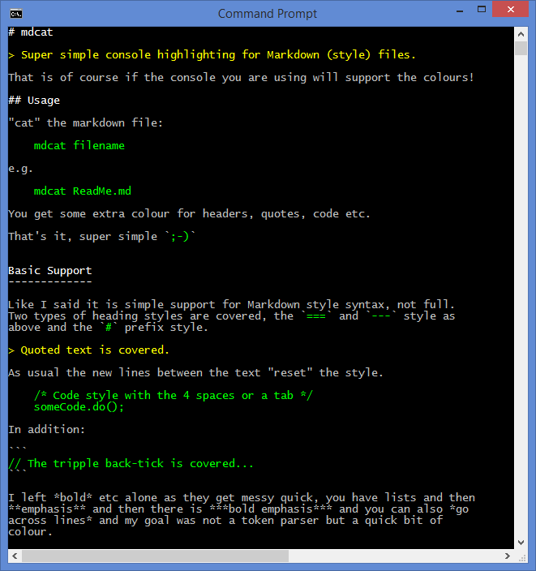

# mdcat

> Super simple console highlighting for Markdown (style) files.

## Current Release

[https://github.com/redolentquack/mdcat/releases](https://github.com/redolentquack/mdcat/releases)

## Usage

"cat" the markdown file:

    mdcat filename

e.g.

    mdcat ReadMe.md

You get some extra colour for headers, quotes, code etc.

That's it, super simple `;-)`

